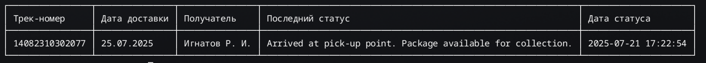

# 📦 Проверка трек-номеров почты

## 🚀 Описание

Приложение для автоматической проверки статуса трек-номеров почты через API сервиса [Moyaposylka](https://moyaposylka.ru/). Поддерживает чтение трек-номеров из файла, выполнение HTTP-запросов к API, форматированный вывод результатов в виде таблицы, формирование файла csv с данными.

## 🛠️ Установка

* Убедитесь, что установлен [Rust](https://www.rust-lang.org/).
  Склонируйте репозиторий:

  ```bash
  git clone https://github.com/igro83/moyaPosylka.git
  ```
* Соберите проект:

  ```bash
  cd moyaPosylka
  cargo build --release
  ```

## 🧪 Использование

* Подготовьте входные данные
  * Создайте файл tracks.txt с вашим списком трек-номеров:<br>
      * Пример:<br>
          RP123456789RU<br>
          CZ987654321PL<br>
* Получите API-ключ
  * Зарегистрируйтесь на [Moyaposylka](https://moyaposylka.ru/) и получите API-ключ.
* Запустите приложение

  ```bash
  ./moyaposylka --file tracks.txt --apikey ваш_api_key
  ```

## 📄 Примеры

Вывод таблицы<br>
<br>


## Ошибки

Введён несуществующий трек-номер RP99999999999
Не удалось добавить трек-номер CZ00000000000 в лк.

## ⚠️ Важно
Обработка ошибок: Приложение автоматически пытается добавить отсутствующие трек-номера в аккаунт пользователя.
## 📜 Лицензия
MIT License
Автор: Роман Игнатов igro83@gmail.com

## 🔄 Расширяемость
Идеи для улучшений:

Добавить поддержку других почтовых сервисов (DHL, FedEx).
Реализовать асинхронную обработку множественных запросов.
Интеграция с Google Sheets для автоматического обновления таблиц.

